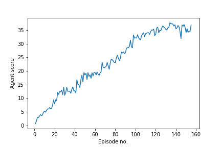

# Robotic arms to the rescue!
For this project, the models were trained on the variation using 20 agents. Through practice, it was proven to be more
stable during training, hence why we opted in using this one.

This environment includes 20 double-jointed arms that can move to target locations, depicted as spheres within the 
environment. A reward of +0.1 is collected for each time-step that the agent's tip (kind of like a hand?!) is touching 
the goal location. Maintaining its position at the target location for as many time steps as possible becomes the 
agent's objective. 

The observation space consists of 33 variables corresponding to:
* position, 
* rotation, 
* velocity, and 
* angular velocities of the arm. 

Each action is a vector with four numbers, corresponding to the torque applied to two joints. Every entry in the action 
vector must be a number between -1 and 1.

Let's recap on the theory behind the components that are used here.

### Deep Deterministic Policy Gradient (DDPG)

#### Q-function
To discover an optimal policy, a Q-function is set up. The Q-function calculates the expected reward `R` for all 
possible actions `A` in all possible states `S`.


We can then define our optimal policy `π*` as the action that maximizes the Q-function for a given state across all 
possible states. The optimal Q-function `Q*(s,a)` maximizes the total expected reward for an agent starting in state `s`
and choosing action `a`, then following the optimal policy for each subsequent state.


In order to discount returns at future time steps, the Q-function can be expanded to include the hyper-parameter gamma 
`γ`.


#### Learning both the policy and the Q-function

DDPG is geared towards concurrent learning of a Q-function and a policy. Remember, in Q-learning, if you know the 
optimal action-value function `Q^*(s,a)`, then in any given state, the optimal action `a^*(s)` can be found by solving:


DDPG interleaves learning an approximator to `Q^*(s,a)` with learning an approximator to `a^*(s)`. The former is 
illustrated by the actor network, while the latter by the critic network.

The actions to be learned belong to a continuous space. This poses an optimisation issue for the `max` operation when 
training our actor network. However, the function Q^*(s,a) is presumed to be differentiable with respect to the action 
argument, allowing the use of gradient-based learning with deep neural nets [1].

Learning is set up as follows:
1. The actor model learns to predict an action vector 
2. The critic model learns Q values for state-action pairs. 
3. DDPG uses experience replay (Replay class) to sample batches of uncorrelated experiences to train on. It also 
distinguishes between local and target models for both actor and critic, similar to fixed Q-targets in the 
double DQN technique. 
4. Local (online) models are updated by minimizing their training loss while target models are updated through soft updates, 
i.e. local model parameters values are partially, and slowly, copied over to the target models. This helps alleviate 
from overestimating Q-values stabilise training.

### Training goals

The agent is trained through episodical training until the environment tis solved. To solve it, we need to hit an 
average reward (over the last 100 episodes) of at least +30.0. For this variation of the experiment, we need all agents 
to reach that step.

### Network architecture

The actor network maps state to action and has the following structure:

* State input (33 units)
* Hidden layer (256 units) with ReLU activation and batch normalization
* Hidden layer (256 units) with ReLU activation
* Action output (4 units) with tanh activation

The critic network maps state and action to Q value and has the following structure:

* State input (33 units)
* Hidden layer (256 nodes) with ReLU activation
* Action input (4 units)
* Hidden layer with inputs from layers 2 and 3 (256 nodes) with ReLU activation
* Q-value output (1 node)

### Hyperparameters

The original paper was an initial reference to tweaking the hyper-parameters in this implementation. Over multiple runs
it became clear that the learning rate (of both the actor and critic) plus the standard deviation of the 
Ornstein–Uhlenbeck (OU) process (sigma) were super important in controlling the stability of the experiment.

For the learning rates, we have tried various configurations from a range of 1e-3 to 3e-4. The intuition behind our 
final choice was that we needed the critic model to learn more quickly, in order to effectively navigate the actor model
in selected better actions over the long run. As for the OU process, we had to tune down sigma from the original 0.2 
down to 0.05.

| Hyperparameter | Stored as | Value | Description |
|---|---:|---:|---|
| Max episodes | max_episodes | 2000 | Maximum number of episodes to train |
| Max steps | max_steps | 1e6 | Maximum number of timesteps per episode |
| Replay buffer size | buffer_size | 1e6 | Maximum size of experience replay buffer |
| Replay batch size | batch_size | 128 | Number of experiences sampled in one batch |
| Actor hidden units | fc1_units, fc2_units | 256, 256 | Number of units in hidden layers of the actor model |
| Actor critic units | fc1_units, fc2_units | 256, 256 | Number of units in hidden layers of the critic model |
| Actor learning rate | lr_actor | 1e-4 | Controls parameters update of the online actor model |
| Critic learning rate | lr_critic | 1e-3 | Controls parameters update of the online critic model |
| Target update mix | target_mix | 1e-3 | Controls parameters update of the target actor and critic models |
| Discount factor | discount | .99 | Discount rate for future rewards |
| Ornstein-Uhlenbeck, mu | N/A | 0 | Mean of the stochastic  process|
| Ornstein-Uhlenbeck, theta | N/A | .15 | Parameter of the stochastic process |
| Ornstein-Uhlenbeck, sigma | N/A | .05 | Standard deviation of the stochastic process |

### Results



```buildoutcfg
Episode No. 120	Average reward: 33.53	Average reward over 100 episodes: 22.50
Episode No. 125	Average reward: 34.72	Average reward over 100 episodes: 23.71
Episode No. 130	Average reward: 35.26	Average reward over 100 episodes: 24.88
Episode No. 135	Average reward: 37.29	Average reward over 100 episodes: 26.07
Episode No. 140	Average reward: 35.49	Average reward over 100 episodes: 27.25
Episode No. 145	Average reward: 31.88	Average reward over 100 episodes: 28.28
Episode No. 150	Average reward: 34.13	Average reward over 100 episodes: 29.19
Episode No. 155	Average reward: 36.90	Average reward over 100 episodes: 30.03

Environment solved in 55 episodes!	Average score over 100 episodes: 30.03
```

### Future work

#### Implementing Prioritized Experience Replay (PER).
Experience replay lets online reinforcement learning agents remember and reuse experiences 
from the past. In prior work, experience transitions were uniformly sampled from a replay 
memory. However, this approach simply replays transitions at the same frequency that they 
were originally experienced, regardless of their significance. To replay important transitions
more frequently, and therefore learn more efficiently, we can use PER.

In addition a more systematic way of searching of optimal values for hyperparameters, 
such as grid search could greatly speed up training endeavours. The epsilon decay schema could also be applied to 
parameters such as the OU process' sigma. Finally, a comparison between DDPG, Proximal Policy Optimization (PPO) and 
Distributed Distributional Deterministic Policy Gradients (D4PG) methods could be explored. 

#### References

* [1] Spinning up - OpenAI. 2020. Deep Deterministic Policy Gradient. [ONLINE] Available at: 
https://spinningup.openai.com/en/latest/algorithms/ddpg.html. [Accessed 10 April 2020].
